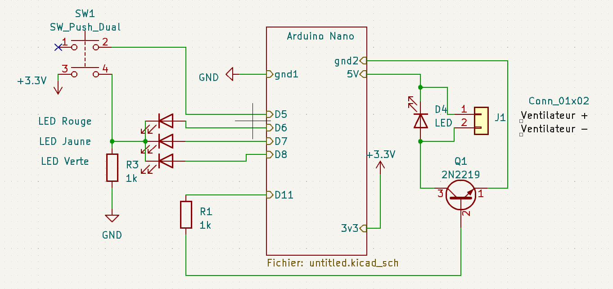

# Fan Controler

## Description
This repository gather all information to create an electronic project to control a fan speed.

## Hardware
For this  project the following electronic components are used.
- Arduino Nano
- 2 resistors
- 1 push button
- 4 Leds
- 1 transistor npn2222
- 5v fan (computer cooling fan)

### Wiring - Electronical schema
An electronical schema has been created according [this source](https://www.instructables.com/PWM-Regulated-Fan-Based-on-CPU-Temperature-for-Ras/). 

The transistor npn2222 allow to dim the fan speed because my computer fan is only an On/Off device. \
A connector will be used to plug and unplug easily the fan. \
The arduino board won't be soldered directly on the PCB, 2 15x1 sockets connectors will be used.

### PCB design
PCB has been designed as well on Kicad. The pcb must get same size or smaller than the arduino board. See 3D simulated PCB:

### GearBox design
3D PCB can be imported on the 3D software (Fusion 360 for example). Then a 3D design can be created based on the PCB shape. 

## Software : 
The following behavior has been push in the arduino nano :  
1- When the arduino is powered, the full power is send to the fan, green led goes on, other stay off.  
2- If the button is pressed, the fan speed is devide per 2. Orange led goes on, other stay off.  
3- If the button is pressed a 2nd time, fan is switch off. Red led goes on, other stay off.  

And so on, and so on... 

  
# Sources
[Arduino Nano Schematic](https://www.teachmemicro.com/wp-content/uploads/2019/06/Arduino-Nano-pinout.jpg)  
[Fan control with transistor](https://www.instructables.com/PWM-Regulated-Fan-Based-on-CPU-Temperature-for-Ras/)  
